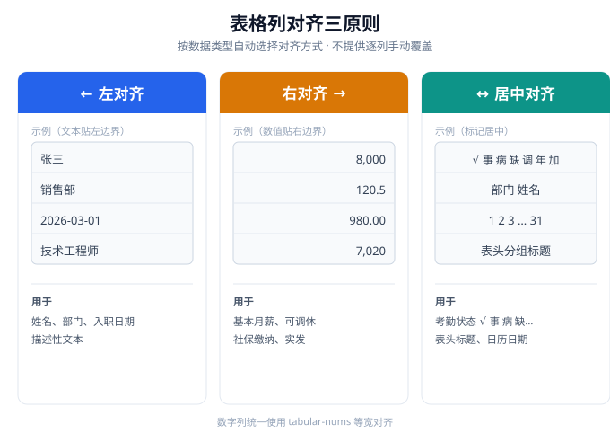

# 开发标准（STANDARD）

> 本文件规定 hr-workbench 的代码规范、数据格式、命名约定与计算口径，确保多人协作、长期维护时一致性。  
> 所有贡献者（包括未来的 AI 协作）都应按此标准编写。

---

## 1. 代码规范

### 1.1 语言与模块
- 使用原生 JavaScript **ES Modules**（`import`/`export`），禁止使用 CommonJS。
- 每个模块只做一件事，文件顶部用 `// ====` 注释块说明职责、对外 API、设计理由。
- 禁止使用 `eval`、`with` 等危险语法。

### 1.2 注释（教材级）
- 所有函数、关键分支必须有中文注释，解释"为什么"而不只是"做什么"。
- 复杂算法（如社保计算、迁移）需逐步说明。
- 示例：不要只写 `// 计算应发`，要写 `// 应发 = 基本月薪 + 出差补贴 + 奖金 + 加班费（税前）`。

### 1.3 命名
- 变量/函数：小驼峰 `restMinutes`、`buildPayroll`。
- 常量：大写下划线 `STORAGE_PREFIX`、`BIG_SICKNESS`。
- 文件：小写下划线 `attendance.js`、`store.js`。
- id：带前缀 + 时间戳，`e_` 员工、`a_` 考勤、`p_` 薪资、`org_` 组织。

### 1.4 样式
- 颜色用 `:root` CSS 变量（`--blue`、`--ok`、`--danger`...），禁止硬编码魔法色值。
- 移动端适配统一用 `@media (max-width:768px)` + `env(safe-area-inset-*)`。
- 圆角、阴影、间距保持全局统一。

### 1.5 表格列对齐规范
按「数据类型」自动选择对齐方式，**不提供逐列手动覆盖**（手动选易破坏整体一致性，且自动规则已是通行最佳实践）：
- **左对齐**：文本类——姓名、部门、入职日期、描述性内容。符合从左往右的阅读流。
- **右对齐**：数值/金额类——基本月薪、可调休、各项社保缴纳、实发等。按个位/小数点对齐，便于横向比较大小与累加（财务表格惯例）。
- **居中对齐**：短标签/状态/日历日期——考勤状态（√事病缺调年加）、表头分组标题、日期数字网格。单字标记等宽，居中视觉最平衡。
- 各模块落地：
  - 花名册：文本左 + 数字右 + 操作列右（推到最右，与「可调休」拉开距离）。
  - 考勤表：状态网格整体居中（含右侧汇总列天数计数，0~31 居中即可）。
  - 薪资表：文本左 + 数字右 + 表头分组标题居中。
- 数字列统一加 `font-variant-numeric:tabular-nums`，保证等宽、对齐整齐。



---

## 2. 数据格式标准（权威 schema）

> 与 `ARCHITECTURE.md` 第 5 节一致。任何模块读写都必须遵守。

### 2.1 员工 employee
```json
{
  "id": "e_1690000000000",
  "name": "张三",
  "dept": "销售部",
  "hireDate": "2026-03-01",
  "baseSalary": 8000,
  "restSeedMinutes": 480,
  "insuranceBase": null,
  "employmentStatus": "active",
  "leaveDate": "",
  "deletedAt": null
}
```

### 2.2 考勤 attendance
```json
{
  "id": "a_2026-08_e_xxx",
  "month": "2026-08",
  "empId": "e_xxx",
  "rec": { "1": { "am": "√", "pm": "√", "ot": "" } },
  "summary": { "出勤": 22, "事假": 0, "病假": 1, "缺勤": 0, "调休": 1, "年假": 0, "加班": 3 }
}
```

### 2.3 薪资 payroll
```json
{
  "id": "p_2026-08_e_xxx",
  "month": "2026-08",
  "empId": "e_xxx",
  "baseSalary": 8000, "travel": 0, "bonus": 500, "overtime": 0,
  "comp": { "养老": 1280, "医疗": 640, "工伤": 16, "失业": 40, "生育": 64, "公积金": 960 },
  "pers": { "养老": 640, "医疗": 160, "失业": 40, "公积金": 960, "大病医疗": 5 },
  "gross": 8500, "persTotal": 1805, "tax": 169.5, "taxManual": false, "net": 6525.5,
  "status": "draft"
}
```

### 2.4 节假日 holidays（Phase 2）
```json
{ "2026-01-01": { "name": "元旦", "type": "holiday" },
  "2026-02-11": { "name": "春节调休上班", "type": "workday" } }
```

### 2.5 组织设置 settings（Phase 2/3）
```json
{
  "overtimeToRest": true,
  "overtimeToRestRatio": 1.0,
  "halfDayMinutes": 240,
  "insuranceRatio": {
    "company":  { "养老": 0.16, "医疗": 0.08, "工伤": 0.002, "失业": 0.005, "生育": 0.008, "公积金": 0.12 },
    "personal": { "养老": 0.08, "医疗": 0.02, "失业": 0.005, "公积金": 0.12 }
  }
}
```

---

## 3. 存储键命名

| 键 | 内容 |
|---|---|
| `wb_hr_orgs` | 组织列表 |
| `wb_hr_current` | 当前组织 id |
| `wb_hr_{orgId}_data` | 某组织全部数据 |

所有键以 `wb_hr_` 前缀开头（见 `config.STORAGE_PREFIX`），避免冲突。

---

## 4. 社保与个税计算口径（演示值）

| 项目 | 公司比例 | 个人比例 | 基数 |
|---|---|---|---|
| 养老 | 16% | 8% | base |
| 医疗 | 8% | 2% | base |
| 工伤 | 0.2% | 0 | base |
| 失业 | 0.5% | 0.5% | base |
| 生育 | 0.8% | 0 | base |
| 公积金 | 12% | 12% | base |
| 大病医疗 | 0 | 固定 5 元 | — |

- 个税：**演示简化**，`(gross - 个人缴纳合计 - 5000) × 10%`，非真实累进税率。
- 基数 `base = employee.insuranceBase ?? payroll.baseSalary`。
- ⚠️ 真实比例以当地最新政策为准；生产环境应使用 `settings.insuranceRatio` 配置，并支持地区差异。

---

## 5. 状态与颜色约定

| 状态 | 字符 | 含义 | 背景/前景 |
|---|---|---|---|
| 出勤 | √ | 正常上班 | 绿 |
| 事假 | 事 | 事假 | 橙 |
| 病假 | 病 | 病假 | 蓝 |
| 缺勤 | 缺 | 缺勤/旷工 | 红 |
| 调休 | 调 | 调休 | 紫 |
| 年假 | 年 | 年假 | 青 |
| 加班 | 加 | 加班 | 黄 |
| 空 | （无） | 未登记 | 白 |

---

## 6. 提交信息规范（Conventional Commits 中文）

格式：`类型(范围): 简述`

| 类型 | 含义 |
|---|---|
| `feat` | 新功能 |
| `fix` | 修复 bug |
| `docs` | 文档 |
| `refactor` | 重构（不改行为） |
| `style` | 样式调整 |
| `perf` | 性能优化 |
| `polish` | 打磨/综合优化 |

示例：
```
feat(roster): 花名册支持编辑、序号、拖拽排序与可调休余额
fix(attendance): 修正节假日日期计算偏移
docs: 添加 5-Phase 优化计划并修正 README 分支说明
```

每个 Phase 完成后提交一次，commit message 见 `docs/PLAN.md` 对应章节。
